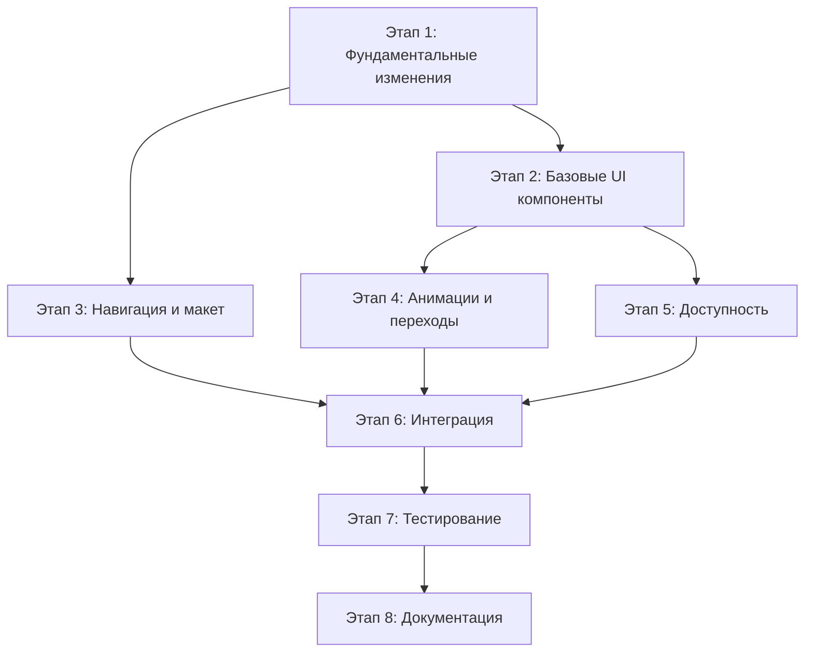

# План имплементации стайл-гайда LandComp

## Обзор

Данный документ содержит подробный план имплементации стайл-гайда LandComp в Flutter приложение. План разбит на этапы с конкретными задачами, приоритетами и временными оценками.

## Текущее состояние

### Анализ существующего кода
- **Тема**: Базовая реализация с Material Design 3
- **Цвета**: Используется `ColorScheme.fromSeed` с зеленым цветом `#2E7D32`
- **Типографика**: Простая реализация с фиксированными размерами
- **Компоненты**: Базовые Material компоненты без кастомизации
- **Шрифты**: Системные шрифты без кастомных семейств

### Необходимые изменения
1. Полная замена цветовой палитры
2. Добавление кастомных шрифтов (Inter, JetBrains Mono)
3. Создание системы дизайн-токенов
4. Реализация всех UI компонентов согласно стайл-гайду
5. Добавление анимаций и переходов
6. Обеспечение доступности (WCAG 2.1 AA)

---

## Этап 1: Фундаментальные изменения (Приоритет: Критический)

### 1.1 Настройка шрифтов
**Время**: 2-3 часа  
**Зависимости**: Нет

#### Задачи:
- [ ] **1.1.1** Добавить шрифты Inter в `assets/fonts/`
  - Inter-Regular.ttf
  - Inter-Medium.ttf
  - Inter-SemiBold.ttf
  - Inter-Bold.ttf
  - Inter-ExtraBold.ttf
- [ ] **1.1.2** Добавить JetBrains Mono в `assets/fonts/`
  - JetBrainsMono-Regular.ttf
  - JetBrainsMono-Medium.ttf
- [ ] **1.1.3** Обновить `pubspec.yaml` с конфигурацией шрифтов
- [ ] **1.1.4** Создать `lib/core/theme/fonts.dart` с константами шрифтов

#### Файлы для изменения:
- `pubspec.yaml`
- `lib/core/theme/fonts.dart` (новый)

### 1.2 Создание системы дизайн-токенов
**Время**: 4-5 часов  
**Зависимости**: 1.1

#### Задачи:
- [ ] **1.2.1** Создать `lib/core/theme/design_tokens.dart`
  - Цветовая палитра (все цвета из стайл-гайда)
  - Система отступов (spacing)
  - Радиусы скругления (border radius)
  - Тени (shadows)
  - Анимации (transitions)
- [ ] **1.2.2** Создать `lib/core/theme/colors.dart`
  - Светлая тема
  - Темная тема
  - Семантические цвета
- [ ] **1.2.3** Создать `lib/core/theme/spacing.dart`
  - Константы отступов (xs, sm, md, lg, xl, 2xl, 3xl)
- [ ] **1.2.4** Создать `lib/core/theme/typography.dart`
  - Динамическая типографическая шкала
  - Responsive размеры шрифтов
  - Line heights и font weights

#### Файлы для создания:
- `lib/core/theme/design_tokens.dart`
- `lib/core/theme/colors.dart`
- `lib/core/theme/spacing.dart`
- `lib/core/theme/typography.dart`

### 1.3 Обновление основной темы
**Время**: 3-4 часа  
**Зависимости**: 1.1, 1.2

#### Задачи:
- [ ] **1.3.1** Полностью переписать `lib/app/theme.dart`
  - Интеграция дизайн-токенов
  - Правильная цветовая схема
  - Типографика согласно стайл-гайду
- [ ] **1.3.2** Создать `lib/core/theme/theme_extensions.dart`
  - Кастомные цвета
  - Дополнительные стили
- [ ] **1.3.3** Обновить `lib/app/app.dart` для использования новой темы
- [ ] **1.3.4** Добавить поддержку темной темы по умолчанию

#### Файлы для изменения:
- `lib/app/theme.dart`
- `lib/core/theme/theme_extensions.dart` (новый)
- `lib/app/app.dart`

---

## Этап 2: Базовые UI компоненты (Приоритет: Высокий)

### 2.1 Система кнопок
**Время**: 4-5 часов  
**Зависимости**: 1.3

#### Задачи:
- [ ] **2.1.1** Создать `lib/shared/widgets/buttons/primary_button.dart`
  - Градиентный фон
  - Все размеры (Large, Medium, Small, Icon)
  - Состояния (hover, active, disabled, loading)
  - Анимации
- [ ] **2.1.2** Создать `lib/shared/widgets/buttons/secondary_button.dart`
  - Светлый фон с зеленой границей
  - Все размеры и состояния
- [ ] **2.1.3** Создать `lib/shared/widgets/buttons/text_button.dart`
  - Прозрачный фон
  - Только текст
- [ ] **2.1.4** Создать `lib/shared/widgets/buttons/button_factory.dart`
  - Фабрика для создания кнопок
  - Единый интерфейс
- [ ] **2.1.5** Обновить тему для использования новых кнопок

#### Файлы для создания:
- `lib/shared/widgets/buttons/primary_button.dart`
- `lib/shared/widgets/buttons/secondary_button.dart`
- `lib/shared/widgets/buttons/text_button.dart`
- `lib/shared/widgets/buttons/button_factory.dart`

### 2.2 Система форм
**Время**: 3-4 часа  
**Зависимости**: 1.3

#### Задачи:
- [ ] **2.2.1** Создать `lib/shared/widgets/forms/custom_text_field.dart`
  - Стилизация согласно стайл-гайду
  - Состояния (default, focus, error, success, disabled)
  - Анимации переходов
- [ ] **2.2.2** Создать `lib/shared/widgets/forms/search_field.dart`
  - Иконка поиска
  - Кнопка очистки
  - Автодополнение
- [ ] **2.2.3** Создать `lib/shared/widgets/forms/custom_checkbox.dart`
  - Минимальный размер 20x20px
  - Анимации hover и focus
- [ ] **2.2.4** Создать `lib/shared/widgets/forms/custom_radio.dart`
  - Стилизация согласно стайл-гайду
- [ ] **2.2.5** Обновить тему для форм

#### Файлы для создания:
- `lib/shared/widgets/forms/custom_text_field.dart`
- `lib/shared/widgets/forms/search_field.dart`
- `lib/shared/widgets/forms/custom_checkbox.dart`
- `lib/shared/widgets/forms/custom_radio.dart`

### 2.3 Система карточек
**Время**: 3-4 часа  
**Зависимости**: 1.3

#### Задачи:
- [ ] **2.3.1** Создать `lib/shared/widgets/cards/base_card.dart`
  - Базовый компонент карточки
  - Тени и скругления
  - Анимации hover
- [ ] **2.3.2** Создать `lib/shared/widgets/cards/plant_card.dart`
  - Карточка растения
  - Изображение 16:9
  - Характеристики
  - Кнопка "Добавить в композицию"
- [ ] **2.3.3** Создать `lib/shared/widgets/cards/feature_card.dart`
  - Карточка функции
  - Иконка 48px
  - Заголовок и описание
  - Индикатор доступности
- [ ] **2.3.4** Создать `lib/shared/widgets/cards/project_card.dart`
  - Карточка проекта
  - Превью композиции
  - Кнопки действий
- [ ] **2.3.5** Создать `lib/shared/widgets/cards/composition_card.dart`
  - Карточка композиции
  - Основной тип карточки

#### Файлы для создания:
- `lib/shared/widgets/cards/base_card.dart`
- `lib/shared/widgets/cards/plant_card.dart`
- `lib/shared/widgets/cards/feature_card.dart`
- `lib/shared/widgets/cards/project_card.dart`
- `lib/shared/widgets/cards/composition_card.dart`

---

## Этап 3: Навигация и макет (Приоритет: Высокий)

### 3.1 Система навигации
**Время**: 4-5 часов  
**Зависимости**: 2.1

#### Задачи:
- [ ] **3.1.1** Создать `lib/shared/widgets/navigation/bottom_navigation.dart`
  - Фиксированная нижняя панель
  - 3-5 основных разделов
  - Иконки + подписи
  - Активные/неактивные состояния
- [ ] **3.1.2** Создать `lib/shared/widgets/navigation/tab_navigation.dart`
  - Горизонтальные вкладки
  - Подчеркивание активной вкладки
- [ ] **3.1.3** Создать `lib/shared/widgets/navigation/drawer_navigation.dart`
  - Выдвижное боковое меню
  - Аватар пользователя
  - Группировка пунктов
- [ ] **3.1.4** Создать `lib/shared/widgets/navigation/breadcrumbs.dart`
  - Показ текущего местоположения
  - Разделители
- [ ] **3.1.5** Обновить `lib/app/router.dart` для интеграции навигации

#### Файлы для создания:
- `lib/shared/widgets/navigation/bottom_navigation.dart`
- `lib/shared/widgets/navigation/tab_navigation.dart`
- `lib/shared/widgets/navigation/drawer_navigation.dart`
- `lib/shared/widgets/navigation/breadcrumbs.dart`

### 3.2 Система макета
**Время**: 2-3 часа  
**Зависимости**: 1.2

#### Задачи:
- [ ] **3.2.1** Создать `lib/shared/widgets/layout/responsive_container.dart`
  - Адаптивные контейнеры
  - Breakpoints (mobile, tablet, desktop)
- [ ] **3.2.2** Создать `lib/shared/widgets/layout/spacing_widgets.dart`
  - Вертикальные и горизонтальные отступы
  - Использование spacing system
- [ ] **3.2.3** Создать `lib/shared/widgets/layout/grid_system.dart`
  - Сетка для каталогов
  - Адаптивные колонки
- [ ] **3.2.4** Обновить существующие страницы для использования новой системы макета

#### Файлы для создания:
- `lib/shared/widgets/layout/responsive_container.dart`
- `lib/shared/widgets/layout/spacing_widgets.dart`
- `lib/shared/widgets/layout/grid_system.dart`

---

## Этап 4: Анимации и переходы (Приоритет: Средний)

### 4.1 Система анимаций
**Время**: 3-4 часа  
**Зависимости**: 2.1, 2.3

#### Задачи:
- [ ] **4.1.1** Создать `lib/shared/animations/button_animations.dart`
  - Button press (scale 0.98)
  - Hover эффекты
  - Loading анимации
- [ ] **4.1.2** Создать `lib/shared/animations/card_animations.dart`
  - Card hover (translateY -4px)
  - Появление карточек
- [ ] **4.1.3** Создать `lib/shared/animations/feedback_animations.dart`
  - Success (зеленая галочка с bounce)
  - Error (красный крестик с shake)
  - Loading (spinner, progress bar)
- [ ] **4.1.4** Создать `lib/shared/animations/page_transitions.dart`
  - Slide переходы
  - Fade переходы
  - Scale переходы
- [ ] **4.1.5** Интегрировать анимации в существующие компоненты

#### Файлы для создания:
- `lib/shared/animations/button_animations.dart`
- `lib/shared/animations/card_animations.dart`
- `lib/shared/animations/feedback_animations.dart`
- `lib/shared/animations/page_transitions.dart`

### 4.2 Микроанимации
**Время**: 2-3 часа  
**Зависимости**: 4.1

#### Задачи:
- [ ] **4.2.1** Добавить анимации в кнопки
- [ ] **4.2.2** Добавить анимации в карточки
- [ ] **4.2.3** Добавить анимации в поля ввода
- [ ] **4.2.4** Добавить анимации в навигацию
- [ ] **4.2.5** Создать `lib/shared/animations/animation_utils.dart` для общих утилит

#### Файлы для создания:
- `lib/shared/animations/animation_utils.dart`

---

## Этап 5: Доступность (Приоритет: Высокий)

### 5.1 WCAG 2.1 AA соответствие
**Время**: 4-5 часов  
**Зависимости**: 2.1, 2.2, 2.3

#### Задачи:
- [ ] **5.1.1** Создать `lib/shared/accessibility/accessibility_utils.dart`
  - Проверка контрастности
  - Утилиты для screen readers
- [ ] **5.1.2** Добавить семантические метки во все компоненты
  - ARIA labels
  - Semantics widgets
- [ ] **5.1.3** Обеспечить клавиатурную навигацию
  - Focus management
  - Skip links
- [ ] **5.1.4** Добавить поддержку масштабирования
  - TextScaler support
  - Responsive размеры
- [ ] **5.1.5** Создать `lib/shared/accessibility/accessibility_test.dart`
  - Тесты доступности
  - Проверка контрастности

#### Файлы для создания:
- `lib/shared/accessibility/accessibility_utils.dart`
- `lib/shared/accessibility/accessibility_test.dart`

### 5.2 Тестирование доступности
**Время**: 2-3 часа  
**Зависимости**: 5.1

#### Задачи:
- [ ] **5.2.1** Написать тесты для всех компонентов
- [ ] **5.2.2** Проверить контрастность всех цветовых комбинаций
- [ ] **5.2.3** Протестировать с screen readers
- [ ] **5.2.4** Проверить клавиатурную навигацию
- [ ] **5.2.5** Документировать требования доступности

---

## Этап 6: Интеграция и обновление существующих компонентов (Приоритет: Высокий)

### 6.1 Обновление существующих страниц
**Время**: 6-8 часов  
**Зависимости**: 2.1, 2.2, 2.3, 3.1

#### Задачи:
- [ ] **6.1.1** Обновить `lib/features/chat/presentation/pages/chat_page.dart`
  - Использование новых компонентов
  - Применение новой темы
  - Интеграция анимаций
- [ ] **6.1.2** Обновить `lib/features/profile/presentation/pages/profile_page.dart`
  - Новые карточки
  - Обновленная типографика
  - Улучшенный макет
- [ ] **6.1.3** Обновить `lib/features/settings/presentation/pages/settings_page.dart`
  - Новые формы
  - Улучшенная навигация
- [ ] **6.1.4** Обновить `lib/features/chat/presentation/widgets/message_bubble.dart`
  - Новые стили
  - Анимации
- [ ] **6.1.5** Обновить `lib/features/chat/presentation/widgets/agent_selector.dart`
  - Новые карточки агентов
  - Улучшенный дизайн

#### Файлы для изменения:
- `lib/features/chat/presentation/pages/chat_page.dart`
- `lib/features/profile/presentation/pages/profile_page.dart`
- `lib/features/settings/presentation/pages/settings_page.dart`
- `lib/features/chat/presentation/widgets/message_bubble.dart`
- `lib/features/chat/presentation/widgets/agent_selector.dart`

### 6.2 Обновление логотипа и брендинга
**Время**: 2-3 часа  
**Зависимости**: 1.2

#### Задачи:
- [ ] **6.2.1** Обновить `lib/shared/widgets/logo_widget.dart`
  - Новые цвета логотипа
  - Адаптивные размеры
- [ ] **6.2.2** Добавить splash screen с новым дизайном
- [ ] **6.2.3** Обновить иконки приложения
- [ ] **6.2.4** Создать favicon для веб-версии

#### Файлы для изменения:
- `lib/shared/widgets/logo_widget.dart`

---

## Этап 7: Тестирование и оптимизация (Приоритет: Средний)

### 7.1 Тестирование компонентов
**Время**: 4-5 часов  
**Зависимости**: 6.1

#### Задачи:
- [ ] **7.1.1** Создать unit тесты для всех новых компонентов
- [ ] **7.1.2** Создать widget тесты для UI компонентов
- [ ] **7.1.3** Создать integration тесты для основных флоу
- [ ] **7.1.4** Тестирование на разных размерах экранов
- [ ] **7.1.5** Тестирование темной и светлой тем

#### Файлы для создания:
- `test/unit/theme/`
- `test/widget/components/`
- `test/integration/`

### 7.2 Производительность и оптимизация
**Время**: 2-3 часа  
**Зависимости**: 7.1

#### Задачи:
- [ ] **7.2.1** Оптимизировать анимации
- [ ] **7.2.2** Проверить производительность рендеринга
- [ ] **7.2.3** Оптимизировать изображения
- [ ] **7.2.4** Проверить размер приложения
- [ ] **7.2.5** Создать `lib/shared/utils/performance_utils.dart`

#### Файлы для создания:
- `lib/shared/utils/performance_utils.dart`

---

## Этап 8: Документация и финализация (Приоритет: Низкий)

### 8.1 Документация компонентов
**Время**: 3-4 часа  
**Зависимости**: 7.1

#### Задачи:
- [ ] **8.1.1** Создать `docs/COMPONENTS_GUIDE.md`
  - Описание всех компонентов
  - Примеры использования
  - API документация
- [ ] **8.1.2** Создать `docs/THEME_USAGE.md`
  - Как использовать тему
  - Примеры кастомизации
- [ ] **8.1.3** Обновить README.md
  - Инструкции по установке
  - Примеры использования
- [ ] **8.1.4** Создать Storybook для компонентов (опционально)

#### Файлы для создания:
- `docs/COMPONENTS_GUIDE.md`
- `docs/THEME_USAGE.md`

### 8.2 Финальная проверка
**Время**: 2-3 часа  
**Зависимости**: 8.1

#### Задачи:
- [ ] **8.2.1** Проверить соответствие стайл-гайду
- [ ] **8.2.2** Проверить все экраны приложения
- [ ] **8.2.3** Проверить темную и светлую темы
- [ ] **8.2.4** Проверить доступность
- [ ] **8.2.5** Создать финальный отчет

---

## Временные оценки

### Общее время разработки: 45-60 часов

| Этап | Время | Приоритет |
|------|-------|-----------|
| Этап 1: Фундаментальные изменения | 9-12 часов | Критический |
| Этап 2: Базовые UI компоненты | 10-13 часов | Высокий |
| Этап 3: Навигация и макет | 6-8 часов | Высокий |
| Этап 4: Анимации и переходы | 5-7 часов | Средний |
| Этап 5: Доступность | 6-8 часов | Высокий |
| Этап 6: Интеграция | 8-11 часов | Высокий |
| Этап 7: Тестирование | 6-8 часов | Средний |
| Этап 8: Документация | 5-7 часов | Низкий |

## Зависимости между этапами

## Критерии готовности

### Этап 1 готов, когда:
- [ ] Все шрифты добавлены и работают
- [ ] Дизайн-токены созданы и используются
- [ ] Основная тема полностью переписана
- [ ] Темная тема работает корректно

### Этап 2 готов, когда:
- [ ] Все типы кнопок реализованы и протестированы
- [ ] Все формы работают с новыми стилями
- [ ] Все карточки созданы и интегрированы
- [ ] Компоненты соответствуют стайл-гайду

### Этап 3 готов, когда:
- [ ] Навигация работает на всех экранах
- [ ] Макет адаптивен для всех размеров экранов
- [ ] Все страницы используют новую систему макета

### Этап 4 готов, когда:
- [ ] Все анимации работают плавно
- [ ] Микроанимации добавлены во все компоненты
- [ ] Производительность анимаций оптимизирована

### Этап 5 готов, когда:
- [ ] Все компоненты протестированы на доступность
- [ ] Контрастность соответствует WCAG 2.1 AA
- [ ] Клавиатурная навигация работает
- [ ] Screen readers корректно читают контент

### Этап 6 готов, когда:
- [ ] Все существующие страницы обновлены
- [ ] Новые компоненты интегрированы
- [ ] Брендинг обновлен
- [ ] Приложение выглядит единообразно

### Этап 7 готов, когда:
- [ ] Все тесты проходят
- [ ] Производительность оптимизирована
- [ ] Приложение работает стабильно

### Этап 8 готов, когда:
- [ ] Документация создана
- [ ] README обновлен
- [ ] Финальная проверка пройдена

## Риски и митигация

### Высокие риски:
1. **Производительность анимаций** - может замедлить приложение
   - *Митигация*: Профилирование и оптимизация
2. **Совместимость с существующим кодом** - может сломать функциональность
   - *Митигация*: Поэтапная интеграция и тестирование
3. **Размер приложения** - добавление шрифтов увеличит размер
   - *Митигация*: Оптимизация шрифтов, использование только необходимых весов

### Средние риски:
1. **Сложность кастомизации** - может быть сложно поддерживать
   - *Митигация*: Хорошая документация и примеры
2. **Время разработки** - может превысить оценки
   - *Митигация*: Приоритизация задач, MVP подход

## Заключение

Данный план обеспечивает полную имплементацию стайл-гайда LandComp с учетом всех требований к дизайну, доступности и производительности. Рекомендуется выполнять этапы последовательно, с обязательным тестированием после каждого этапа.

---

*Документ создан: $(date)*  
*Версия: 1.0*  
*Статус: Готов к реализации*
